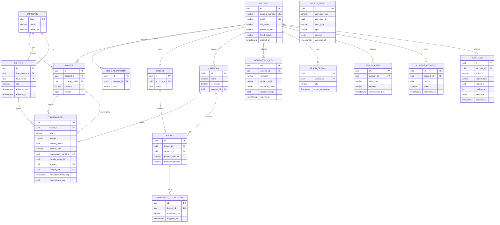

# Database Design — DigitalWallet

> Đề xuất ERD cho lớp ledger PostgreSQL 16, suy ra từ [project-info.md](project-info.md) (FR/NFR) và các quy ước trong [.claude/rules/backend_coding.md](.claude/rules/backend_coding.md). Đây là tài liệu thiết kế — Flyway migration sẽ phái sinh từ tài liệu này.

---

## 1. Quy ước chung

- **Engine:** PostgreSQL 16 ([§4.3](project-info.md#43-persistence--data)).
- **PK:** `uuid` (ưu tiên UUIDv7 sinh phía ứng dụng để time-ordered → lợi cho index BTREE + outbox poller theo `created_at`).
- **Tiền tệ:** `numeric(19,4)`, không bao giờ dùng `double`/`float` ([§13](project-info.md#13-coding-conventions-highest-level-project-wide)).
- **Thời gian:** `timestamptz` lưu UTC, serialize ISO-8601.
- **Mã tiền tệ:** `char(3)` ISO 4217, FK về bảng `currency`.
- **Tên định danh:** `snake_case` ([§13](project-info.md#13-coding-conventions-highest-level-project-wide)).
- **Mọi bảng có** `created_at timestamptz NOT NULL DEFAULT now()`; bảng có cập nhật có thêm `updated_at`. `audit_log` và `outbox_event` chỉ thêm/insert, không update.
- **Enum:** dùng `varchar` + `CHECK` constraint (dễ migrate hơn `CREATE TYPE`).
- **Không có cascade DELETE** trên dữ liệu tài chính (account/wallet/transaction). Soft-delete bằng cờ trạng thái khi cần.

---

## 2. Bảng — Identity & RBAC

### 2.1 `account` (FR1.1, [§8](project-info.md#8-security-baseline))

| Column | Type | Constraint | Ghi chú |
|---|---|---|---|
| `id` | `uuid` | PK | UUIDv7 |
| `account_number` | `varchar(20)` | UNIQUE, NOT NULL | Mã định danh public (P2P transfer by account_number — FR1.3) |
| `email` | `varchar(255)` | UNIQUE, NOT NULL | PII |
| `full_name` | `varchar(255)` | NOT NULL | PII |
| `password_hash` | `varchar(255)` | NOT NULL | Argon2id ([security §2](.claude/rules/security.md#2-authentication)) |
| `fraud_status` | `varchar(16)` | NOT NULL DEFAULT `'ACTIVE'`, CHECK ∈ {`ACTIVE`,`SUSPENDED`} | FR2.4 — đọc bởi sync pre-check (NFR9) |
| `fraud_status_changed_at` | `timestamptz` | NULL | Audit cho FR2.4 |
| `fraud_status_changed_by` | `uuid` | FK → `account.id` NULL | `FRAUD_ANALYST` (khi unblock) hoặc NULL (khi async consumer flip) |
| `created_at` | `timestamptz` | NOT NULL DEFAULT now() | |
| `updated_at` | `timestamptz` | NOT NULL DEFAULT now() | |

**Index:** `account_number`, `email` (unique đã có); BTREE thêm trên `fraud_status` partial index `WHERE fraud_status = 'SUSPENDED'`.

### 2.2 `role_assignment` ([§2.2](project-info.md#22-roles-in-the-system), [ADR #9](docs/decisions/0009-rbac-roles.md))

| Column | Type | Constraint |
|---|---|---|
| `id` | `uuid` | PK |
| `account_id` | `uuid` | FK → `account.id`, NOT NULL |
| `role` | `varchar(32)` | CHECK ∈ {`USER`,`ADMIN`,`FRAUD_ANALYST`} |
| `granted_at` | `timestamptz` | NOT NULL |
| `granted_by` | `uuid` | FK → `account.id`, NULL (system grant: NULL) |
| UNIQUE | `(account_id, role)` | | |

`USER` được seed tự động khi tạo account; `ADMIN`/`FRAUD_ANALYST` do `ADMIN` cấp qua admin path, ghi `audit_log`.

---

## 3. Bảng — Currency & FX

### 3.1 `currency`

| Column | Type | Constraint |
|---|---|---|
| `code` | `char(3)` | PK (ISO 4217) |
| `name` | `varchar(64)` | NOT NULL |
| `minor_unit` | `smallint` | NOT NULL DEFAULT 2 |

Seed (Flyway V2): `USD`, `EUR`, `VND`, `JPY`, `GBP`, ...

### 3.2 `fx_rate` (ADR #6, [§9](project-info.md#9-domain-glossary), [§11](project-info.md#11-explicit-non-goals-out-of-scope))

Static, admin-mutable. Read-through cached Redis TTL = `FX_RATE_TTL_SECONDS`.

| Column | Type | Constraint |
|---|---|---|
| `id` | `uuid` | PK |
| `from_currency` | `char(3)` | FK → `currency.code` |
| `to_currency` | `char(3)` | FK → `currency.code` |
| `rate` | `numeric(19,8)` | NOT NULL, CHECK > 0 |
| `effective_from` | `timestamptz` | NOT NULL |
| `effective_to` | `timestamptz` | NULL (NULL = hiện hành) |
| `updated_by` | `uuid` | FK → `account.id`, NULL cho seed |
| UNIQUE | `(from_currency, to_currency, effective_from)` | | |
| CHECK | `from_currency <> to_currency` | | |

**Index:** `(from_currency, to_currency)` partial `WHERE effective_to IS NULL` — đường nóng lookup.

---

## 4. Bảng — Wallet & Ledger

### 4.1 `wallet` (FR1.1)

| Column | Type | Constraint |
|---|---|---|
| `id` | `uuid` | PK |
| `account_id` | `uuid` | FK → `account.id`, NOT NULL |
| `currency_code` | `char(3)` | FK → `currency.code`, NOT NULL |
| `balance` | `numeric(19,4)` | NOT NULL DEFAULT 0, CHECK ≥ 0 |
| `version` | `bigint` | NOT NULL DEFAULT 0 (optimistic-lock fallback nếu cần; chính sách chủ đạo vẫn là `PESSIMISTIC_WRITE` — NFR1) |
| `created_at`, `updated_at` | `timestamptz` | NOT NULL |
| UNIQUE | `(account_id, currency_code)` | | **FR1.1: một ví trên một currency / account** |

`PESSIMISTIC_WRITE` (`SELECT ... FOR UPDATE`) khoá row khi giao dịch trên money path (NFR1).

### 4.2 `transaction` (ledger row — FR1.2/1.3/1.4)

Mỗi chuyển động ví là một row. Transfer = 2 row liên kết qua `transfer_group_id`.

| Column | Type | Constraint |
|---|---|---|
| `id` | `uuid` | PK (UUIDv7) |
| `wallet_id` | `uuid` | FK → `wallet.id`, NOT NULL |
| `type` | `varchar(20)` | CHECK ∈ {`DEPOSIT`,`WITHDRAW`,`TRANSFER_DEBIT`,`TRANSFER_CREDIT`} |
| `amount` | `numeric(19,4)` | CHECK > 0 (sign suy ra từ `type`) |
| `currency_code` | `char(3)` | NOT NULL (=`wallet.currency_code`) |
| `balance_after` | `numeric(19,4)` | NOT NULL — snapshot post-commit (cho statement & reconcile) |
| `counterparty_wallet_id` | `uuid` | FK → `wallet.id`, NULL trừ khi `type` ∈ {`TRANSFER_DEBIT`,`TRANSFER_CREDIT`} |
| `transfer_group_id` | `uuid` | NULL hoặc UUIDv7 dùng chung cho 2 leg của một transfer |
| `fx_rate_id` | `uuid` | FK → `fx_rate.id`, NULL trừ khi cross-currency |
| `category_id` | `uuid` | FK → `category.id`, NULL (gợi ý PFM — FR1.3) |
| `transaction_timestamp` | `timestamptz` | NOT NULL — **event time** (NFR7) |
| `idempotency_key` | `uuid` | NULL — lưu để trace |
| `description` | `varchar(255)` | NULL |
| `created_at` | `timestamptz` | NOT NULL DEFAULT now() (processing time) |

**Index:**
- BTREE `(wallet_id, transaction_timestamp DESC)` — FR1.4 statement filter.
- BTREE `(transfer_group_id)` partial `WHERE transfer_group_id IS NOT NULL` — pairing 2 leg.
- BTREE `(transaction_timestamp)` — dashboard daily aggregation (FR3.1).
- BTREE `(category_id, transaction_timestamp)` — PFM MV refresh.

> **Lưu ý NFR6:** Không UPDATE trực tiếp `transaction` từ pfm/. PFM chỉ READ.

---

## 5. Bảng — Cross-cutting infrastructure

### 5.1 `idempotency_key` (NFR3)

| Column | Type | Constraint |
|---|---|---|
| `key` | `uuid` | PK |
| `account_id` | `uuid` | FK → `account.id`, NOT NULL |
| `endpoint` | `varchar(64)` | NOT NULL (`/transfers`, `/deposits`, `/withdraws`) |
| `request_hash` | `varchar(64)` | NOT NULL (SHA-256 của body chuẩn hoá — phân biệt replay vs `idempotency.replay_conflict`) |
| `response_status` | `smallint` | NOT NULL |
| `response_body` | `jsonb` | NOT NULL |
| `created_at` | `timestamptz` | NOT NULL |
| `expires_at` | `timestamptz` | NOT NULL — TTL ~24h, dọn bằng `@Scheduled` |

**Index:** BTREE `expires_at` cho job dọn.

### 5.2 `outbox_event` (NFR2 — Transactional Outbox + [ADR #5](docs/decisions/0005-outbox-publisher.md))

| Column | Type | Constraint |
|---|---|---|
| `id` | `uuid` | PK (UUIDv7) |
| `aggregate_type` | `varchar(64)` | NOT NULL (`transaction`, `transaction_blocked`, `account_suspension`) |
| `aggregate_id` | `uuid` | NOT NULL |
| `event_type` | `varchar(64)` | NOT NULL (`transaction.committed`, `transaction.blocked`, `account.suspended`) |
| `topic` | `varchar(64)` | NOT NULL (`transaction-events`, `fraud-alerts`, …) |
| `payload` | `jsonb` | NOT NULL |
| `created_at` | `timestamptz` | NOT NULL |
| `published_at` | `timestamptz` | NULL — poller set sau khi `send().get()` thành công |
| `attempts` | `smallint` | NOT NULL DEFAULT 0 |

**Index:** BTREE `(published_at NULLS FIRST, created_at)` partial `WHERE published_at IS NULL` — poller scan.

### 5.3 `audit_log` ([§8](project-info.md#8-security-baseline) — SOC 2, append-only)

| Column | Type | Constraint |
|---|---|---|
| `id` | `uuid` | PK |
| `principal_id` | `uuid` | FK → `account.id`, NULL cho system |
| `principal_role` | `varchar(32)` | NULL — snapshot role tại thời điểm hành động |
| `action` | `varchar(64)` | NOT NULL (`auth.login.success`, `auth.login.failure`, `transfer.commit`, `fraud.block.velocity`, `fraud.block.volume`, `account.suspended`, `account.unsuspended`, `admin.user.read`, `role.grant`, `fraud.threshold.update`) |
| `subject_type` | `varchar(32)` | NULL (`account`,`wallet`,`transaction`,`role_assignment`) |
| `subject_id` | `uuid` | NULL |
| `justification` | `text` | NULL — bắt buộc cho `account.unsuspended` ([§8](project-info.md#8-security-baseline)) |
| `metadata` | `jsonb` | NOT NULL DEFAULT `'{}'` (errorKey, IP, UA, request_id, ...) |
| `occurred_at` | `timestamptz` | NOT NULL DEFAULT now() |

**Index:** BTREE `(occurred_at DESC)`, `(principal_id, occurred_at DESC)`, `(action, occurred_at)`.

**Append-only:** revoke UPDATE/DELETE bằng GRANT/REVOKE; thêm trigger `RAISE EXCEPTION` trong `BEFORE UPDATE/DELETE`.

---

## 6. Bảng — Fraud (async consumer state)

### 6.1 `fraud_breach` (theo dõi vi phạm cho FR2.4 suspension policy)

Async consumer drain `transaction-events` (block events) → ghi 1 row / vi phạm; query `account_id + window` để quyết định flip `SUSPENDED`.

| Column | Type | Constraint |
|---|---|---|
| `id` | `uuid` | PK |
| `account_id` | `uuid` | FK → `account.id`, NOT NULL |
| `rule` | `varchar(32)` | CHECK ∈ {`VELOCITY`,`VOLUME`} |
| `transaction_attempt_id` | `uuid` | NULL — id tham chiếu attempt từ payload |
| `event_timestamp` | `timestamptz` | NOT NULL — event time |
| `details` | `jsonb` | NOT NULL |
| `created_at` | `timestamptz` | NOT NULL |

**Index:** BTREE `(account_id, event_timestamp DESC)` — query window suspension.

> **Lý do có bảng này thay vì chỉ Redis:** sliding-window counter ở Redis là edge check (NFR9, sync). Suspension policy là async + cần khả năng audit/reconstruct → cần durable. Cũng phục vụ analyst review (FR3.2 backlog).

### 6.2 `fraud_alert` (alert stream — FR2.5, FR3.2)

| Column | Type | Constraint |
|---|---|---|
| `id` | `uuid` | PK |
| `account_id` | `uuid` | FK → `account.id`, NOT NULL |
| `alert_type` | `varchar(32)` | CHECK ∈ {`VELOCITY_BREACH`,`VOLUME_BREACH`,`REPEAT_BREACH`,`SUSPENSION`} |
| `severity` | `varchar(16)` | CHECK ∈ {`LOW`,`MEDIUM`,`HIGH`} |
| `payload` | `jsonb` | NOT NULL |
| `created_at` | `timestamptz` | NOT NULL |
| `acknowledged_at` | `timestamptz` | NULL |
| `acknowledged_by` | `uuid` | FK → `account.id`, NULL |

**Index:** BTREE `(created_at DESC)`, `(acknowledged_at)` partial `WHERE acknowledged_at IS NULL`.

---

## 7. Bảng — PFM (CQRS-friendly — NFR6)

### 7.1 `category`

| Column | Type | Constraint |
|---|---|---|
| `id` | `uuid` | PK |
| `name` | `varchar(64)` | NOT NULL |
| `icon` | `varchar(64)` | NULL |
| `is_system` | `boolean` | NOT NULL DEFAULT false |
| `account_id` | `uuid` | FK → `account.id`, NULL khi `is_system = true` |
| UNIQUE | `(account_id, name)` | | |

Seed system categories qua Flyway: `Food`, `Entertainment`, `Shopping`, `Transport`, `Bills`, `Health`, `Other`.

### 7.2 `budget` (FR4.1)

| Column | Type | Constraint |
|---|---|---|
| `id` | `uuid` | PK |
| `account_id` | `uuid` | FK → `account.id`, NOT NULL |
| `month` | `date` | NOT NULL, CHECK `EXTRACT(DAY FROM month) = 1` (YYYY-MM-01) |
| `created_at`, `updated_at` | `timestamptz` | NOT NULL |
| UNIQUE | `(account_id, month)` | | `budget.duplicate_month` |

### 7.3 `bucket` (planned amount — FR4.1/4.3)

| Column | Type | Constraint |
|---|---|---|
| `id` | `uuid` | PK |
| `budget_id` | `uuid` | FK → `budget.id`, NOT NULL |
| `category_id` | `uuid` | FK → `category.id`, NOT NULL |
| `planned_amount` | `numeric(19,4)` | NOT NULL, CHECK > 0 |
| `threshold_percent` | `smallint` | NOT NULL, CHECK BETWEEN 1 AND 100 (FR4.3) |
| `created_at`, `updated_at` | `timestamptz` | NOT NULL |
| UNIQUE | `(budget_id, category_id)` | | |

> **`bucket` không chứa `spent_amount`.** `spent` thuộc read-model — Redis hot path + MV backup (NFR6).

### 7.4 `bucket_state_mv` (MATERIALIZED VIEW — NFR6 durable backup)

```sql
CREATE MATERIALIZED VIEW bucket_state_mv AS
SELECT
  b.id              AS bucket_id,
  b.budget_id,
  b.category_id,
  bg.account_id,
  bg.month,
  COALESCE(SUM(t.amount), 0)::numeric(19,4) AS spent_amount,
  MAX(t.transaction_timestamp)              AS last_event_timestamp
FROM bucket b
JOIN budget bg ON bg.id = b.budget_id
LEFT JOIN transaction t
  ON t.category_id = b.category_id
 AND t.type IN ('WITHDRAW','TRANSFER_DEBIT')
 AND date_trunc('month', t.transaction_timestamp) = bg.month
 AND t.wallet_id IN (SELECT id FROM wallet WHERE account_id = bg.account_id)
GROUP BY b.id, b.budget_id, b.category_id, bg.account_id, bg.month;

CREATE UNIQUE INDEX bucket_state_mv_pk ON bucket_state_mv(bucket_id);
```

`REFRESH MATERIALIZED VIEW CONCURRENTLY bucket_state_mv` chạy qua `@Scheduled` (ví dụ mỗi 5 phút) — đây là durable source để **rebuild Redis hash** sau cache loss (NFR6).

### 7.5 `threshold_notification` (idempotency cho FR5.1)

Tránh gửi alert lặp khi consumer replay.

| Column | Type | Constraint |
|---|---|---|
| `id` | `uuid` | PK |
| `bucket_id` | `uuid` | FK → `bucket.id`, NOT NULL |
| `threshold_kind` | `varchar(16)` | CHECK ∈ {`SOFT_LIMIT`,`PREDICTIVE`} |
| `triggered_at` | `timestamptz` | NOT NULL |
| `spent_at_trigger` | `numeric(19,4)` | NOT NULL |
| UNIQUE | `(bucket_id, threshold_kind)` | | Một alert / bucket / kind / tháng |

---

## 8. Bảng — AI Advisor (FR6.x, NFR8)

### 8.1 `advisor_request`

| Column | Type | Constraint |
|---|---|---|
| `id` | `uuid` | PK (=`request_id` trả về 202) |
| `account_id` | `uuid` | FK → `account.id`, NOT NULL |
| `month` | `date` | NOT NULL |
| `status` | `varchar(16)` | CHECK ∈ {`PENDING`,`COMPLETED`,`FAILED`,`CIRCUIT_OPEN`} |
| `prompt_hash` | `varchar(64)` | NOT NULL — hash của payload **đã ẩn danh** ([§8](project-info.md#8-security-baseline)) |
| `response_body` | `jsonb` | NULL |
| `error_key` | `varchar(64)` | NULL |
| `created_at` | `timestamptz` | NOT NULL |
| `completed_at` | `timestamptz` | NULL |

> Không lưu prompt/response gốc ([security.md §7](.claude/rules/security.md#7-sensitive-data-exposure) — LLM payload không persist với user identifier).

### 8.2 `advisor_plan_suggestion` (FR6.3 — optional)

| Column | Type | Constraint |
|---|---|---|
| `id` | `uuid` | PK |
| `account_id` | `uuid` | FK → `account.id`, NOT NULL |
| `for_month` | `date` | NOT NULL |
| `suggested_buckets` | `jsonb` | NOT NULL — `[{category_id, planned_amount, threshold_percent}, ...]` |
| `applied_at` | `timestamptz` | NULL |
| `created_at` | `timestamptz` | NOT NULL |

---

## 9. Quan hệ (FK) — Tổng kết

```
account ─┬─< role_assignment
         ├─< wallet ─< transaction (self-ref counterparty)
         ├─< budget ─< bucket >─ category
         ├─< category (user-defined)
         ├─< idempotency_key
         ├─< fraud_breach
         ├─< fraud_alert
         ├─< advisor_request
         ├─< advisor_plan_suggestion
         └─< audit_log (principal & subject)

currency ─< wallet
currency ─< fx_rate (from/to) ─< transaction
category ─< transaction
bucket   ─< threshold_notification
bucket   ─< bucket_state_mv (MV, not FK)
```

---

## 10. ERD (Mermaid)



---

## 11. Bản đồ ràng buộc ↔ NFR/FR

| Ràng buộc / Bảng | NFR / FR | Giải thích |
|---|---|---|
| `wallet UNIQUE(account_id, currency_code)` | FR1.1 | Một ví mỗi currency mỗi account |
| `wallet.balance ≥ 0` + `PESSIMISTIC_WRITE` | NFR1 | DB lock authoritative; balance không âm |
| `transaction` + `outbox_event` cùng `@Transactional` | NFR2 | Atomic ledger + outbox |
| `idempotency_key.request_hash` UNIQUE check | NFR3 | Replay → response cũ; conflict body → `idempotency.replay_conflict` |
| `transaction.transaction_timestamp` (event time) | NFR7 | PFM/MV/aggregator dùng event time, không wall-clock |
| `bucket` không có `spent_amount` + `bucket_state_mv` | NFR6 | CQRS — Redis hot + MV backup |
| `account.fraud_status` enum | FR2.4 / NFR9 | Sync pre-check đọc; async consumer flip |
| `fraud_breach`, `fraud_alert` | FR2.4 / FR2.5 | Async consumer state durable |
| `audit_log` append-only + trigger | [§8](project-info.md#8-security-baseline) SOC 2 | Immutable trail |
| `advisor_request` không lưu prompt/response gốc | [security.md §7](.claude/rules/security.md#7-sensitive-data-exposure) | LLM anonymisation |
| `outbox_event.published_at NULL partial index` | NFR2 + [ADR #5](docs/decisions/0005-outbox-publisher.md) | Hot scan cho poller |

---

## 12. Danh sách index cần Flyway tạo (recap)

- `account_account_number_key` (UNIQUE)
- `account_email_key` (UNIQUE)
- `idx_account_fraud_status_suspended` BTREE `(fraud_status)` WHERE `'SUSPENDED'`
- `wallet_account_currency_key` UNIQUE `(account_id, currency_code)`
- `idx_transaction_wallet_time` `(wallet_id, transaction_timestamp DESC)`
- `idx_transaction_group` `(transfer_group_id)` WHERE NOT NULL
- `idx_transaction_time` `(transaction_timestamp)`
- `idx_transaction_category_time` `(category_id, transaction_timestamp)`
- `idx_fx_rate_current` `(from_currency, to_currency)` WHERE `effective_to IS NULL`
- `idx_outbox_unpublished` `(published_at NULLS FIRST, created_at)` WHERE `published_at IS NULL`
- `idx_idempotency_expires` `(expires_at)`
- `idx_audit_log_occurred` `(occurred_at DESC)`
- `idx_audit_log_principal_time` `(principal_id, occurred_at DESC)`
- `idx_fraud_breach_account_time` `(account_id, event_timestamp DESC)`
- `idx_fraud_alert_unack` `(acknowledged_at)` WHERE NULL
- `bucket_state_mv_pk` UNIQUE `(bucket_id)` (cho REFRESH CONCURRENTLY)

---

## 13. Vấn đề mở / Cần quyết định trước khi viết Flyway

1. **UUID generator:** chọn `uuid_generate_v7()` (cần extension hoặc sinh client) vs `gen_random_uuid()` (pgcrypto, v4). Khuyến nghị: sinh phía Java (UUIDv7) để time-ordered → outbox poller scan rẻ.
2. **`balance_after` lưu trên row hay tính lại?** Đề xuất lưu — tránh full scan khi xem statement; cost = phải tính trong service nhưng đơn giản vì đã giữ wallet lock.
3. **`fraud_breach` retention:** TTL bao lâu? Đề xuất khớp `FRAUD_SUSPENSION_WINDOW_SECONDS` × 2 (mặc định 2h), job dọn nightly.
4. **`audit_log` retention:** SOC 2 thường 1 năm minimum; cần ADR trước khi mở rộng.
5. **`bucket_state_mv` refresh cadence:** đề xuất 5 phút; tunable qua `app.pfm.mv.refresh-cron`.
6. **Categories — system vs user:** seed 7 system categories cứng. User chỉ thêm custom — không sửa system. Cần quyết định khi viết FR4.x.
7. **`advisor_request.prompt_hash`:** hash gồm những field nào? Phụ thuộc ADR #2 (LLM provider).
8. **Partitioning `transaction`:** chưa cần MVP, nhưng nếu ≥ 10M row thì partition theo `transaction_timestamp` (RANGE monthly) — note để revisit sau.

---

*End of db-design.md — sẵn sàng cho Flyway `V2__core_schema.sql` (V1 đã có baseline rỗng).*
