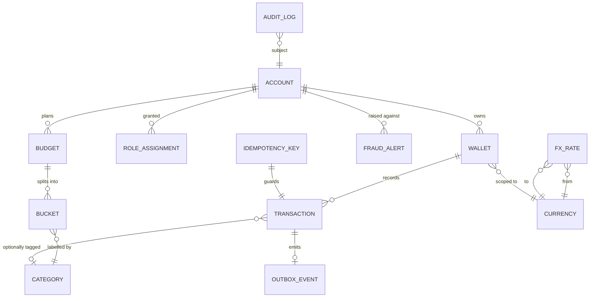

# Database

This page describes the authoritative ledger schema for DigitalWallet, derived from the entities referenced in [../../project-info.md §3.1](../../project-info.md#31-module--package-organization), [../../project-info.md §5](../../project-info.md#5-functional-requirements-epics--frs), and [../../project-info.md §9](../../project-info.md#9-domain-glossary). The store is **PostgreSQL 16** ([../../project-info.md §4.3](../../project-info.md#43-persistence--data)); Redis is a derived hot read-model and is not described here.

All table and column listings below are `(spec — not yet implemented)` — they describe the intended schema until Flyway migrations land. See [migrations.md](migrations.md) for the migration policy.

## ERD

## Tables

### `account`

Identity record per user. Owns wallets, budgets, and role assignments.

| Column | Type | Constraint | Purpose |
|---|---|---|---|
| `id` | `uuid` | PK | Internal account identifier. |
| `account_number` | `varchar` | UNIQUE NOT NULL | External-facing identifier used as a transfer destination (FR1.3). |
| `email` | `varchar` | UNIQUE NOT NULL | Login identity, PII ([../../project-info.md §8](../../project-info.md#8-security-baseline)). |
| `full_name` | `varchar` | NOT NULL | PII. |
| `password_hash` | `varchar` | NOT NULL | Hashed credential. Algorithm `(verify)`. |
| `fraud_status` | `varchar` | NOT NULL CHECK (in `ACTIVE`,`SUSPENDED`) DEFAULT `'ACTIVE'` | Read by the sync money path pre-check (NFR9); flipped to `SUSPENDED` by the async fraud consumer (FR2.4). Cleared only by a `FRAUD_ANALYST` action with an `audit_log` entry. |
| `created_at` | `timestamptz` | NOT NULL | Creation time, UTC. |
| `updated_at` | `timestamptz` | NOT NULL | Last mutation time. |

### `role_assignment`

Joins accounts to one or more of the three roles defined in [../../project-info.md §2.2](../../project-info.md#22-roles-in-the-system) (`USER`, `ADMIN`, `FRAUD_ANALYST`). See [../decisions/0009-rbac-roles.md](../decisions/0009-rbac-roles.md).

| Column | Type | Constraint | Purpose |
|---|---|---|---|
| `id` | `uuid` | PK | — |
| `account_id` | `uuid` | FK → `account.id`, NOT NULL | Account being granted. |
| `role` | `varchar` | NOT NULL CHECK (in `USER`,`ADMIN`,`FRAUD_ANALYST`) | RBAC role. |
| `granted_at` | `timestamptz` | NOT NULL | Audit trail. |
| `granted_by` | `uuid` | FK → `account.id` | Who granted it (NULL for the default `USER` grant on signup). |

### `currency`

Reference table of supported ISO 4217 currency codes. Seeded via Flyway.

| Column | Type | Constraint | Purpose |
|---|---|---|---|
| `code` | `varchar(3)` | PK | ISO 4217 code (`USD`, `EUR`, …). |
| `name` | `varchar` | NOT NULL | Human-readable label. |
| `minor_units` | `smallint` | NOT NULL | Display rounding (informational; `numeric(19,4)` is used internally). |

### `wallet`

A balance-bearing record scoped to a single currency ([../../project-info.md §9](../../project-info.md#9-domain-glossary)). An account MAY own multiple wallets, including more than one in the same currency — siblings are disambiguated by an account-supplied `label` ([../decisions/0006-multi-currency-model.md](../decisions/0006-multi-currency-model.md)).

| Column | Type | Constraint | Purpose |
|---|---|---|---|
| `id` | `uuid` | PK | Internal wallet id. Also the key for the Redis lock (NFR1). |
| `account_id` | `uuid` | FK → `account.id`, NOT NULL | Owner. |
| `currency_code` | `varchar(3)` | FK → `currency.code`, NOT NULL | ISO 4217. |
| `label` | `varchar(64)` | NOT NULL | Account-supplied display name (e.g. `"Savings USD"`, `"Travel USD"`). Used to disambiguate siblings in the same currency. |
| `balance` | `numeric(19,4)` | NOT NULL DEFAULT 0 | Authoritative balance. Mutated under `LockModeType.PESSIMISTIC_WRITE` (NFR1). |
| `opened_at` | `timestamptz` | NOT NULL | Creation time. |
| `closed_at` | `timestamptz` | NULL | Soft-close marker `(verify — not explicit in spec)`. |
| UNIQUE | `(account_id, label)` | — | Labels are unique per account so a wallet can be picked unambiguously in the UI. There is intentionally **no** `UNIQUE (account_id, currency_code)` — multiple wallets in the same currency are a first-class case. |

### `transaction`

Authoritative ledger row for any wallet movement (deposit, withdraw, or one leg of a transfer). Umbrella term per [../../project-info.md §9](../../project-info.md#9-domain-glossary).

| Column | Type | Constraint | Purpose |
|---|---|---|---|
| `id` | `uuid` | PK | Transaction id. |
| `wallet_id` | `uuid` | FK → `wallet.id`, NOT NULL | Wallet whose balance moved. |
| `type` | `varchar` | NOT NULL CHECK (in `deposit`,`withdraw`,`transfer_debit`,`transfer_credit`) | Movement kind. |
| `amount` | `numeric(19,4)` | NOT NULL | Signed amount in the wallet's currency. |
| `currency_code` | `varchar(3)` | FK → `currency.code`, NOT NULL | Mirrored from `wallet` for query convenience. |
| `category_id` | `uuid` | FK → `category.id`, NULL | Optional PFM label (FR1.3). |
| `counterparty_wallet_id` | `uuid` | FK → `wallet.id`, NULL | Other leg of a transfer; NULL for deposit / withdraw. |
| `fx_rate_id` | `uuid` | FK → `fx_rate.id`, NULL | FX rate applied for cross-currency transfers. |
| `transaction_timestamp` | `timestamptz` | NOT NULL | **Event time** carried into Kafka (NFR7). |
| `created_at` | `timestamptz` | NOT NULL | DB insert time. |
| `idempotency_key_id` | `uuid` | FK → `idempotency_key.id`, NULL | Guard for the originating request (NFR3). |

### `outbox_event`

Sibling row written in the same DB transaction as the ledger row; drained to Kafka by the scheduled poller (NFR2). See [../decisions/0005-outbox-publisher.md](../decisions/0005-outbox-publisher.md).

| Column | Type | Constraint | Purpose |
|---|---|---|---|
| `id` | `uuid` | PK | Event id (also Kafka key for idempotency on consumers). |
| `aggregate_type` | `varchar` | NOT NULL | e.g. `transaction`. |
| `aggregate_id` | `uuid` | NOT NULL | Foreign key into the originating row. |
| `topic` | `varchar` | NOT NULL | Destination Kafka topic (e.g. `transaction-events`). |
| `payload` | `jsonb` | NOT NULL | Serialised event body including `transaction_timestamp` (NFR7). |
| `created_at` | `timestamptz` | NOT NULL | DB insert time. |
| `published_at` | `timestamptz` | NULL | Set by the poller once successfully delivered. |

### `idempotency_key`

Tracks client-supplied `Idempotency-Key` headers on mutating money endpoints (NFR3). Hot lookups go through Redis; this table is the durable record.

| Column | Type | Constraint | Purpose |
|---|---|---|---|
| `id` | `uuid` | PK | — |
| `key` | `varchar` | UNIQUE NOT NULL | Client-supplied UUID. |
| `account_id` | `uuid` | FK → `account.id`, NOT NULL | Scope the key to one user. |
| `endpoint` | `varchar` | NOT NULL | e.g. `POST /transfers`. |
| `request_hash` | `varchar` | NOT NULL | Hash of canonicalised body; detects key reuse with a different payload. |
| `response_status` | `int` | NULL | HTTP status returned on first success. |
| `response_body` | `jsonb` | NULL | Original response body to return on replay. |
| `created_at` | `timestamptz` | NOT NULL | First-seen time. |

### `category`

User-facing label attached to a transaction or budget bucket ([../../project-info.md §9](../../project-info.md#9-domain-glossary)).

| Column | Type | Constraint | Purpose |
|---|---|---|---|
| `id` | `uuid` | PK | — |
| `name` | `varchar` | UNIQUE NOT NULL | e.g. `Food`, `Entertainment`. |
| `created_at` | `timestamptz` | NOT NULL | — |

### `budget`

Monthly per-account spending plan (FR4.1).

| Column | Type | Constraint | Purpose |
|---|---|---|---|
| `id` | `uuid` | PK | — |
| `account_id` | `uuid` | FK → `account.id`, NOT NULL | Owner. |
| `month` | `date` | NOT NULL | First day of the budgeted month. |
| `currency_code` | `varchar(3)` | FK → `currency.code`, NOT NULL | Budget reporting currency `(verify — multi-currency reporting not detailed in spec)`. |
| `created_at` | `timestamptz` | NOT NULL | — |
| UNIQUE | `(account_id, month)` | — | One plan per month per user. |

### `bucket`

One row of a budget — `(user, month, category, planned_amount, spent_amount)` ([../../project-info.md §9](../../project-info.md#9-domain-glossary)).

| Column | Type | Constraint | Purpose |
|---|---|---|---|
| `id` | `uuid` | PK | — |
| `budget_id` | `uuid` | FK → `budget.id`, NOT NULL | Parent plan. |
| `category_id` | `uuid` | FK → `category.id`, NOT NULL | Bucket label. |
| `planned_amount` | `numeric(19,4)` | NOT NULL | Cap chosen by the user. |
| `threshold_percent` | `smallint` | NULL | Soft warning level (FR4.3), e.g. `80`. |
| `spent_amount_mv` | `numeric(19,4)` | NULL | Most-recent materialised view value for the bucket (NFR6); Redis is the hot path. |
| UNIQUE | `(budget_id, category_id)` | — | One bucket per category per plan. |

### `fx_rate`

Static seed of `(from_currency, to_currency) → rate`; admin-mutable ([../../project-info.md §9](../../project-info.md#9-domain-glossary), [../decisions/0006-multi-currency-model.md](../decisions/0006-multi-currency-model.md)). Cached read-through in Redis with TTL `FX_RATE_TTL_SECONDS`.

| Column | Type | Constraint | Purpose |
|---|---|---|---|
| `id` | `uuid` | PK | — |
| `from_currency` | `varchar(3)` | FK → `currency.code`, NOT NULL | Source currency. |
| `to_currency` | `varchar(3)` | FK → `currency.code`, NOT NULL | Target currency. |
| `rate` | `numeric(19,8)` | NOT NULL | Multiplicative rate; precision wider than money columns to preserve round-trip fidelity. |
| `effective_at` | `timestamptz` | NOT NULL | When the rate becomes active. |
| `created_at` | `timestamptz` | NOT NULL | — |
| UNIQUE | `(from_currency, to_currency, effective_at)` | — | Allows admin to retire and replace a rate. |

### `fraud_alert`

Output of the async fraud engine (FR2.1, FR2.2, FR2.4, FR2.5); fed onto `fraud-alerts` for WebSocket fan-out (FR3.2). Inline blocking lives in the sync money path (NFR9, [../../project-info.md §6](../../project-info.md#6-non-functional-requirements--invariants)).

| Column | Type | Constraint | Purpose |
|---|---|---|---|
| `id` | `uuid` | PK | — |
| `account_id` | `uuid` | FK → `account.id`, NOT NULL | Subject account. |
| `rule` | `varchar` | NOT NULL CHECK (in `velocity`,`volume`,`suspension`) | Rule that fired (`suspension` covers FR2.4 transitions). |
| `evidence` | `jsonb` | NOT NULL | Window, counts, sums, transition state — enough to reproduce the decision. |
| `raised_at` | `timestamptz` | NOT NULL | Detection time. |
| `resolved_at` | `timestamptz` | NULL | Set by a fraud analyst `(verify)`. |
| `resolution` | `varchar` | NULL CHECK (in `confirmed`,`false_positive`) | Outcome `(verify)`. |

### `audit_log`

Immutable append-only record covering authentication events, role grants, transfers, fraud-rule changes, fraud-driven blocks (FR2.1–FR2.2), account suspensions / un-suspensions (FR2.4), and admin reads of user data ([../../project-info.md §8](../../project-info.md#8-security-baseline)).

| Column | Type | Constraint | Purpose |
|---|---|---|---|
| `id` | `uuid` | PK | — |
| `actor_account_id` | `uuid` | FK → `account.id`, NULL | Who took the action (NULL for system events). |
| `subject_account_id` | `uuid` | FK → `account.id`, NULL | Whose data was touched. |
| `action` | `varchar` | NOT NULL | e.g. `auth.login`, `role.grant`, `transfer.commit`, `transfer.blocked`, `fraud.rule.update`, `fraud.account.suspend`, `fraud.account.unsuspend`, `admin.user.read`. |
| `payload` | `jsonb` | NOT NULL | Minimal redacted context (no PII). |
| `occurred_at` | `timestamptz` | NOT NULL | UTC. |

> The table is enforced as append-only by absence of `UPDATE`/`DELETE` privileges for the application role `(verify)`.

### Materialized view: `bucket_spent_mv` `(spec — not yet implemented)`

Backs NFR6 — durable backup and rebuild source for the Redis hot read-model. Computed from `transaction` joined to `bucket` by `(account_id, category_id, month_of(transaction_timestamp))`, refreshed by a scheduled job. See [../decisions/0004-cqrs-budget-read-model.md](../decisions/0004-cqrs-budget-read-model.md).

## Naming conventions

- **Identifier case:** SQL identifiers are `snake_case` ([../../project-info.md §13](../../project-info.md#13-coding-conventions-highest-level-project-wide)).
- **Primary keys:** `uuid` generated client-side (typically `uuidv7` for time-orderability) `(verify)`. Single-column PKs named `id`.
- **Foreign keys:** `<referenced_table_singular>_id` (e.g. `account_id`, `wallet_id`).
- **Timestamps:** UTC, `timestamptz`, ISO-8601 on the wire. Every table carries at least `created_at`; mutable tables also carry `updated_at`.
- **Money:** `numeric(19,4)`. Currency codes are ISO 4217 stored as `varchar(3)`.
- **Enums:** modelled as `varchar` with `CHECK` constraints, not Postgres `ENUM` types, so values can evolve via plain SQL migrations.
- **Indexes:** every FK column is indexed `(verify)`; query-driven secondary indexes (e.g. `(wallet_id, transaction_timestamp DESC)` for FR1.4) are added per epic.
- **Constraints:** `NOT NULL` is the default; nullability is documented per column.
- **Schema layout:** all tables live in the default `public` schema `(verify)`.
