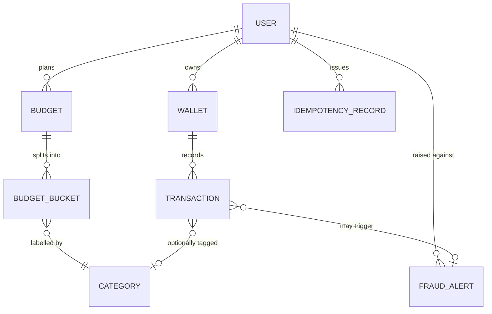

# Database

This page describes the authoritative ledger schema for DigitalWallet, derived from the entities referenced in [../../project-info.md §3.1](../../project-info.md#31-module--package-organization), [../../project-info.md §5](../../project-info.md#5-functional-requirements-epics--frs), and [../../project-info.md §9](../../project-info.md#9-domain-glossary). The store is **PostgreSQL 16** ([../../project-info.md §4.3](../../project-info.md#43-persistence--data)); Redis is a derived hot read-model and is not described here.

All table and column listings below are `(spec — not yet implemented)` — they describe the intended schema until Flyway migrations land. See [migrations.md](migrations.md) for the migration policy.

## ERD

## MVP scope notes

The schema below is the **MVP cut**. Three concepts referenced by the original spec are intentionally **deferred** and not present in this version:

| Deferred concept | Why deferred | When to bring back |
|---|---|---|
| `ROLE_ASSIGNMENT` table (multi-role per user) | Single-role-per-user is simpler. The `role` column on `user` covers `USER` / `ADMIN` for MVP. | When a user must hold more than one role simultaneously, or when SOC 2 access-review history needs a separate audit table. |
| `FRAUD_ANALYST` role | No manual unsuspend / fraud-rule-tuning UI in MVP. ADMIN currently covers any operational read of fraud state. | When manual unsuspend (FR2.4 manual leg) or analyst workflows ship — that change requires an ADR superseding [../decisions/0009-rbac-roles.md](../decisions/0009-rbac-roles.md). |
| `AUDIT_LOG` table | SOC 2 compliance scope deferred. No manual unsuspend means no justification field is collected yet. | When any privileged action that requires durable justification ships (manual unsuspend, role grants UI, admin reads of user PII). |

Other MVP simplifications:
- `USER.base_currency` is **immutable** and chosen at signup. Every budget is implicitly scoped to it (no `BUDGET.currency` column).
- `CATEGORY` is a small reference table seeded via Flyway; `id` is `int` rather than `uuid` to save space and simplify joins.
- One transfer = **two transaction rows** (debit + credit) sharing the same `transfer_id`. No `counterparty_wallet_id`; the counter-leg is discovered by `transfer_id`.

## Tables

### `user`

Identity record per user. Owns wallets, budgets, and fraud alerts. The MVP holds the role inline on this row (no separate `role_assignment` table — see MVP scope notes).

| Column | Type | Constraint | Purpose |
|---|---|---|---|
| `id` | `uuid` | PK | Internal user identifier. |
| `email` | `varchar` | UNIQUE NOT NULL | Login identity, PII ([../../project-info.md §8](../../project-info.md#8-security-baseline)). |
| `password_hash` | `varchar` | NOT NULL | Hashed credential. Algorithm `(verify)`. |
| `role` | `varchar` | NOT NULL CHECK (in `USER`,`ADMIN`) DEFAULT `'USER'` | Single RBAC role per user; see [../decisions/0009-rbac-roles.md](../decisions/0009-rbac-roles.md). |
| `base_currency` | `char(3)` | NOT NULL | Chosen at signup, **immutable**. Every budget owned by this user is implicitly scoped to this currency; the PFM consumer converts cross-currency spending via the snapshotted FX rate on `transaction`. |
| `fraud_status` | `varchar` | NOT NULL CHECK (in `ACTIVE`,`SUSPENDED`) DEFAULT `'ACTIVE'` | Read by the sync money path pre-check (NFR9); flipped to `SUSPENDED` by the async fraud consumer (FR2.4). Manual unsuspend is deferred. |
| `created_at` | `timestamptz` | NOT NULL | Creation time, UTC. |

> Note: `user` is not a reserved word in PostgreSQL but it shadows `CURRENT_USER` in some contexts. Quote with double quotes (`"user"`) in DDL/DML, or alias as `app_user` in the JPA `@Table(name = "...")` if quoting becomes noisy.

### `wallet`

A balance-bearing record scoped to a single currency ([../../project-info.md §9](../../project-info.md#9-domain-glossary)). A user MAY own multiple wallets, including more than one in the same currency — siblings are disambiguated by a user-supplied `label` ([../decisions/0006-multi-currency-model.md](../decisions/0006-multi-currency-model.md)).

| Column | Type | Constraint | Purpose |
|---|---|---|---|
| `id` | `uuid` | PK | Internal wallet id. Also the key for the Redis lock (NFR1). |
| `user_id` | `uuid` | FK → `user.id`, NOT NULL | Owner. |
| `currency` | `char(3)` | NOT NULL CHECK (ISO 4217 whitelist) | ISO 4217 code (`USD`, `VND`, …). Whitelist enforced via CHECK constraint in Flyway. |
| `label` | `varchar(64)` | NOT NULL | User-supplied display name (e.g. `"Savings USD"`, `"Travel USD"`). |
| `balance` | `numeric(19,4)` | NOT NULL DEFAULT 0 | Authoritative balance. Mutated under `LockModeType.PESSIMISTIC_WRITE` (NFR1). |
| `updated_at` | `timestamptz` | NOT NULL | Last mutation time. |
| UNIQUE | `(user_id, label)` | — | Labels are unique per user so a wallet can be picked unambiguously in the UI. **No** `UNIQUE (user_id, currency)` — multiple wallets in the same currency are a first-class case (ADR #6). |

### `category`

User-facing label attached to a transaction or budget bucket ([../../project-info.md §9](../../project-info.md#9-domain-glossary)). Small reference table seeded via Flyway.

| Column | Type | Constraint | Purpose |
|---|---|---|---|
| `id` | `int` | PK | Stable id used by `transaction.category_id` and `budget_bucket.category_id`. |
| `code` | `varchar` | UNIQUE NOT NULL | Machine code, e.g. `FOOD`, `TRAVEL`. |
| `label` | `varchar` | NOT NULL | Display name, e.g. `Ăn uống`. |

### `transaction`

Authoritative ledger row for any wallet movement. One row per **leg**: deposit and withdraw produce one row each; transfer produces two rows (debit + credit) sharing a `transfer_id`.

| Column | Type | Constraint | Purpose |
|---|---|---|---|
| `id` | `uuid` | PK | Transaction id. |
| `wallet_id` | `uuid` | FK → `wallet.id`, NOT NULL | Wallet whose balance moved (= this leg's wallet). |
| `transfer_id` | `uuid` | NULL | UUID shared between the two legs of a single `TRANSFER`; NULL for `DEPOSIT` and `WITHDRAW`. |
| `direction` | `varchar` | NOT NULL CHECK (in `DEBIT`,`CREDIT`) | Sign of the balance change. `amount` is always positive; sign is encoded by `direction`. |
| `type` | `varchar` | NOT NULL CHECK (in `DEPOSIT`,`WITHDRAW`,`TRANSFER`) | Movement kind. The 4-value API filter (`deposit` / `withdraw` / `transfer_debit` / `transfer_credit`) is derived by combining `type` + `direction`. |
| `amount` | `numeric(19,4)` | NOT NULL CHECK (`amount > 0`) | Absolute amount in the wallet's currency. |
| `exchange_rate` | `numeric(19,8)` | NULL | FX rate snapshot used at transfer time. NULL for `DEPOSIT`, `WITHDRAW`, and same-currency `TRANSFER`. Stored on **both** legs of a cross-currency transfer with the same value (Convention A: rate is `from_currency → to_currency` per the FX_RATE lookup). |
| `category_id` | `int` | FK → `category.id`, NULL | Optional PFM label (FR1.3). By convention only the spending leg carries it (`DEBIT` direction for `WITHDRAW` / `TRANSFER_DEBIT`); credit legs are NULL. |
| `event_timestamp` | `timestamptz` | NOT NULL | **Event time** carried into Kafka (NFR7). Set by the service at commit. |
| `created_at` | `timestamptz` | NOT NULL | DB insert time (≈ event time on the success path; diverges on retro/backfill). |

> No FK to `IDEMPOTENCY_RECORD` — the link runs the other way, via `idempotency_record.response_snapshot` which embeds the resulting `transaction_id`(s).

### `fraud_alert`

Output of the async fraud engine (FR2.5); fed onto `fraud-alerts` for WebSocket fan-out (FR3.2). Inline blocking lives in the sync money path (NFR9, [../../project-info.md §6](../../project-info.md#6-non-functional-requirements--invariants)).

| Column | Type | Constraint | Purpose |
|---|---|---|---|
| `id` | `uuid` | PK | — |
| `user_id` | `uuid` | FK → `user.id`, NOT NULL | Subject user. Always present (including alerts raised from a block-path attempt with no ledger row). |
| `transaction_id` | `uuid` | FK → `transaction.id`, NULL | Committed transaction that triggered the alert. NULL for blocks under FR2.1 / FR2.2 (no ledger row is written per FR2.3). |
| `rule_violated` | `varchar` | NOT NULL | Rule that fired (e.g. `VELOCITY`, `VOLUME`). |
| `message` | `varchar` | NOT NULL | Human-readable alert text shown in the admin dashboard. |
| `status` | `varchar` | NOT NULL CHECK (in `OPEN`,`RESOLVED`) DEFAULT `'OPEN'` | Lightweight workflow state for the analyst UI. |
| `created_at` | `timestamptz` | NOT NULL | Detection time. |

### `idempotency_record`

Tracks client-supplied `Idempotency-Key` headers on mutating money endpoints (NFR3). The durable record that enforces "return the original outcome" on replay; **must** be checked before any business logic / wallet lock.

| Column | Type | Constraint | Purpose |
|---|---|---|---|
| `id` | `uuid` | PK | Surrogate id. |
| `user_id` | `uuid` | FK → `user.id`, NOT NULL | Scope keys per user — prevents cross-tenant key collision. |
| `endpoint` | `varchar` | NOT NULL | e.g. `POST /transfers`. Prevents the same key from colliding when reused on a different endpoint. |
| `idempotency_key` | `varchar` | NOT NULL | Client-supplied UUIDv7. |
| `request_hash` | `varchar` | NOT NULL | SHA-256 of the canonicalised request body; detects key reuse with a different payload (`idempotency.replay_conflict`). |
| `status` | `varchar` | NOT NULL CHECK (in `IN_FLIGHT`,`COMPLETED`) | Handles concurrent retry: a second worker arriving while the first is still processing sees `IN_FLIGHT` and is rejected. |
| `response_status` | `int` | NULL | HTTP status returned on the original request (NULL while `IN_FLIGHT`). |
| `response_snapshot` | `jsonb` | NULL | Original response body to return byte-for-byte on replay (NULL while `IN_FLIGHT`). |
| `created_at` | `timestamptz` | NOT NULL | First-seen time. |
| `expires_at` | `timestamptz` | NOT NULL | TTL cleanup (e.g. `created_at + 24h`). A cron `DELETE WHERE expires_at < now()` drains expired rows. |
| UNIQUE | `(user_id, endpoint, idempotency_key)` | — | The constraint that makes `INSERT … ON CONFLICT DO NOTHING` work as the claim primitive. |

### `budget`

Monthly per-user spending plan (FR4.1). Budget currency is implicit — every budget is scoped to the owning user's `base_currency`.

| Column | Type | Constraint | Purpose |
|---|---|---|---|
| `id` | `uuid` | PK | — |
| `user_id` | `uuid` | FK → `user.id`, NOT NULL | Owner. |
| `month` | `date` | NOT NULL CHECK (`EXTRACT(DAY FROM month) = 1`) | First day of the budgeted month (`YYYY-MM-01`). |
| `created_at` | `timestamptz` | NOT NULL | — |
| UNIQUE | `(user_id, month)` | — | One plan per month per user. |

### `budget_bucket`

One row of a budget — `(budget, category, planned_amount, threshold_percent)`. **No `spent_amount` column** — the spent state lives in Redis (hot read-model) and a Postgres materialized view (durable backup) per NFR6.

| Column | Type | Constraint | Purpose |
|---|---|---|---|
| `id` | `uuid` | PK | — |
| `budget_id` | `uuid` | FK → `budget.id`, NOT NULL | Parent plan. |
| `category_id` | `int` | FK → `category.id`, NOT NULL | Bucket label. |
| `planned_amount` | `numeric(19,4)` | NOT NULL CHECK (`planned_amount > 0`) | Cap chosen by the user, in the owning user's `base_currency`. |
| `threshold_percent` | `smallint` | NULL CHECK (`threshold_percent BETWEEN 1 AND 100`) | Soft warning level (FR4.3). NULL when the user has not set a threshold. |
| UNIQUE | `(budget_id, category_id)` | — | One bucket per category per plan. |

### `outbox_event`

Sibling row written in the same DB transaction as a money mutation; drained to Kafka by the scheduled poller (NFR2). See [../decisions/0005-outbox-publisher.md](../decisions/0005-outbox-publisher.md).

| Column | Type | Constraint | Purpose |
|---|---|---|---|
| `id` | `uuid` | PK | Event id (also Kafka key for de-duplication on consumers). |
| `aggregate_type` | `varchar` | NOT NULL | e.g. `TRANSACTION`, `USER`. |
| `aggregate_id` | `uuid` | NOT NULL | Foreign key into the originating row (logical only, not enforced as FK because `aggregate_type` varies). |
| `event_type` | `varchar` | NOT NULL | e.g. `TransferCompleted`, `DepositCompleted`, `TransactionBlocked`, `AccountSuspended`. |
| `payload` | `jsonb` | NOT NULL | Self-contained event body including `event_timestamp` (NFR7). Consumers should not have to join back to the source table. |
| `created_at` | `timestamptz` | NOT NULL | DB insert time. Used by the poller for `ORDER BY created_at ASC`. |
| `published_at` | `timestamptz` | NULL | Set by the poller once successfully delivered. NULL → row is in the poll queue; non-NULL value enables lag metrics (`now() - created_at` for stale rows). |

### `fx_rate`

Static seed of `(from_currency, to_currency) → rate`; admin-mutable ([../../project-info.md §9](../../project-info.md#9-domain-glossary), [../decisions/0006-multi-currency-model.md](../decisions/0006-multi-currency-model.md)). Cached read-through in Redis with TTL `FX_RATE_TTL_SECONDS`.

| Column | Type | Constraint | Purpose |
|---|---|---|---|
| `from_currency` | `char(3)` | NOT NULL, part of PK | Source currency. |
| `to_currency` | `char(3)` | NOT NULL, part of PK | Target currency. |
| `rate` | `numeric(19,8)` | NOT NULL CHECK (`rate > 0`) | Multiplicative rate; precision wider than money columns to preserve round-trip fidelity. |
| `updated_at` | `timestamptz` | NOT NULL | Last admin mutation. |
| PRIMARY KEY | `(from_currency, to_currency)` | — | Composite PK. Seed both directions in Flyway to avoid computing reciprocals at runtime (which loses precision). |

### Materialized view: `bucket_spent_mv` `(spec — not yet implemented)`

Backs NFR6 — durable backup and rebuild source for the Redis hot read-model. Computed from `transaction` joined to `budget_bucket` by `(user_id, category_id, month_of(event_timestamp))`, refreshed by a scheduled job. See [../decisions/0004-cqrs-budget-read-model.md](../decisions/0004-cqrs-budget-read-model.md).

## Naming conventions

- **Identifier case:** SQL identifiers are `snake_case` ([../../project-info.md §13](../../project-info.md#13-coding-conventions-highest-level-project-wide)).
- **Primary keys:** `uuid` generated client-side (typically `uuidv7` for time-orderability) `(verify)`. Single-column PKs named `id`. Reference tables (e.g. `category`) may use `int`.
- **Foreign keys:** `<referenced_table_singular>_id` (e.g. `user_id`, `wallet_id`, `category_id`).
- **Timestamps:** UTC, `timestamptz`, ISO-8601 on the wire. Every table carries at least `created_at`; mutable tables also carry `updated_at`.
- **Money:** `numeric(19,4)`. Currency codes are ISO 4217 stored as `char(3)` and validated by CHECK constraint (not via a separate `currency` reference table — ISO 4217 is an external standard, see [../decisions/0006-multi-currency-model.md](../decisions/0006-multi-currency-model.md)).
- **Enums:** modelled as `varchar` with `CHECK` constraints, not Postgres `ENUM` types, so values can evolve via plain SQL migrations.
- **Indexes:** every FK column is indexed `(verify)`; query-driven secondary indexes (e.g. `(wallet_id, event_timestamp DESC)` for FR1.4) are added per epic.
- **Constraints:** `NOT NULL` is the default; nullability is documented per column.
- **Schema layout:** all tables live in the default `public` schema `(verify)`.
