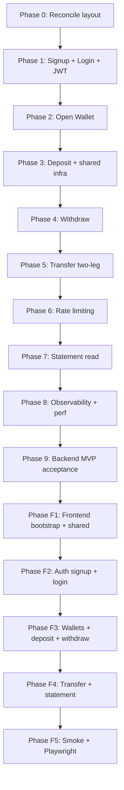

# Implementation Plan: MVP Master Roadmap (Epic 1 only)

- **Date:** 2026-05-25
- **Ticket:** n/a (master plan)
- **Story points:** M — backend Epic 1 + frontend Epic 1; each phase will be sized as its own follow-up `/make-plan`.
- **Milestone:** Epic 1 — Core Wallet Management (FR1.1 – FR1.4) end-to-end on backend AND frontend. Epics 2, 3, 4, 5, 6 are all deferred post-MVP.
- **Assignees:** unassigned
- **Affected modules (backend):** `shared`, `account`, `wallet`. NOT shipped in MVP: `fraud`, `pfm`, `advisor`, `dashboard`.
- **Affected modules (frontend):** `app/`, `routes/`, `features/{auth,wallet,transfer,statement}/`, `shared/{ui,money,idempotency,config}`.
- **Suggested branch name:** none — each follow-up plan branches independently from `main`.

---

## 2. Context / Problem Statement

DigitalWallet's full product contract is in [../../project-info.md](../../project-info.md), the per-feature business rules under [../../docs/business-rules/](../../docs/business-rules/), the API catalog in [../../docs/api/README.md](../../docs/api/README.md), the schema under [../../docs/database/README.md](../../docs/database/README.md), and ten ADRs under [../../docs/decisions/](../../docs/decisions/).

**Reality check (2026-05-25).** The repository diverges from the documented baseline:

- `digital-wallet-api/` exists with a Quarkus 3.35.4 starter (`org.acme.GreetingResource`); no feature modules, no Flyway migrations, no `shared/` infrastructure, no JaCoCo configuration, no docker-compose.
- `backend/` and `frontend/` directories — referenced by `CLAUDE.md`, all rule files, and `.github/workflows/ci.yml` — do not exist.
- Frontend was removed in commit `5759fbb` and is back in scope, **in full Epic-1 form**, at the end of this master plan.

**Scope decision (user direction, 2026-05-25).** MVP is reduced to **Epic 1 only — Core Wallet Management** with the **full frontend** alongside:

- **Cut entirely:** Epic 2 (Fraud Detection — both sync NFR9 pre-check *and* async consumer + alerts), Epic 3 (Admin Dashboard), Epic 4 (PFM Budgets), Epic 5 (PFM Notifications), Epic 6 (AI Advisor).
- **Kept (backend):** Epic 1 in full — signup, login, open wallet, deposit, withdraw, transfer, statement.
- **Kept (frontend):** every Epic-1 user-facing flow — signup, login, wallet list, open wallet, deposit, withdraw, transfer, statement.
- **Kept (security floor — not part of any epic):** rate limiting on `POST /transfers`, JWT auth, RBAC at the inbound web adapter AND the application service (use case), idempotency, hybrid concurrency, outbox WRITE atomicity, CORS allow-list, security headers, sort whitelist. These are cross-cutting rules from [../../.claude/rules/security.md](../../.claude/rules/security.md) and are not optional even with no fraud / PFM / advisor.

**Consequence — NFR9 is explicitly deferred.** [../../CLAUDE.md](../../CLAUDE.md) names NFR9 a "non-negotiable invariant": every wallet mutation MUST evaluate fraud velocity (FR2.1), volume (FR2.2), and `account.fraud_status` (FR2.4) on the request thread before opening the DB transaction. With Epic 2 cut, the slimmed MVP **does NOT honour NFR9**. This is a documented MVP limitation — the money path runs without fraud blocking. The omission MUST be closed by a Phase-X plan before any production-shaped milestone; the `account.fraud_status` column still ships in V1 of the `account` table so a post-MVP fraud module can be wired without a destructive migration.

**Other shared-infra consequences:**

- **Outbox table is still required** in Phase 3 — NFR2 mandates that ledger writes and outbox writes commit atomically. The audit trail is the point.
- **Outbox poller, Kafka container, `transaction-events` topic, and SmallRye Reactive Messaging are deferred** — nothing subscribes in MVP. The atomic ledger+outbox WRITE remains; the publish path arrives with the first consumer post-MVP.
- **No WebSocket endpoints in MVP backend** — no consumer, no UI.
- **`shared/security/` ships only the JWT REST verifier** in Phase 1. WS upgrade validation is deferred.
- **ADR 0002 (LLM provider) stays Open** — Epic 6 deferred.
- **ADR 0011 (Observability Stack) is drafted Proposed alongside this plan** — Phase 8 needs it.

**Desired end state.** A working multi-currency wallet platform on a single docker-compose host: signup/login → open multiple wallets per currency → deposit / withdraw / transfer (with idempotency, hybrid concurrency, rate limiting) → statement read → all reachable from a working Vue frontend with the Epic-1 user flows.

## 3. Scope

### In Scope

- Backend epic: Epic 1 (FR1.1 – FR1.4) in full.
- Cross-cutting shared infra needed by Epic 1: `shared/{exception, security (REST JWT), money, idempotency, outbox (write-only), lock, ratelimit, validation}` and Flyway migrations.
- Frontend: full Epic 1 — signup, login, wallet list, open wallet, deposit, withdraw, transfer, statement.
- Resolution of two open items as written ADRs:
  - [ADR 0001](../../docs/decisions/0001-jwt-signing-algorithm.md) → Accepted in Phase 1.
  - [ADR 0011](0011-observability-stack.md) Observability Stack — drafted Proposed alongside this plan; flips to Accepted in Phase 8.
- Per-phase acceptance criteria objective enough for PASS/FAIL review.

### Out of Scope

- Implementation code — this is a planning artifact only.
- **Epic 2 in any form** — including the sync NFR9 fraud pre-check. NFR9 is a deferred MVP invariant violation; documented in §10 and §14.
- Epic 3 (Admin Dashboard), Epic 4 (PFM Budgets), Epic 5 (PFM Notifications), Epic 6 (AI Advisor).
- Kafka producer + outbox poller + `transaction-events` topic — deferred until the first consumer ships post-MVP.
- All WebSocket endpoints — no consumer, no UI.
- `audit_log` table, `FRAUD_ANALYST` role, manual unsuspend — already deferred by [ADR 0009](../../docs/decisions/0009-rbac-roles.md).
- Production deployment (Kubernetes, secrets manager) — out of scope per [../../project-info.md §11](../../project-info.md#11-explicit-non-goals-out-of-scope).
- Per-phase low-level design (file lists, exact DTOs, exact test names) — produced by follow-up `/make-plan` calls.

## 4. Open Questions (MANDATORY)

Status legend: **Unanswered (open)** | **Answered (closed)** | **Deferred (tracked elsewhere)**

| # | Question | Status | Resolution / Owner |
|---|---|---|---|
| 1 | Repo layout: `digital-wallet-api/` vs `backend/`? | Answered | Phase 0 renames `digital-wallet-api/` → `backend/` and re-roots the package at `com.digitalwallet`. |
| 2 | Big-bang bootstrap vs incremental? | Answered | Incremental. Each phase brings only the infra its slice needs. (User direction 2026-05-25.) |
| 3 | Frontend in scope? | Answered | Yes, full Epic 1 frontend (every FR1.x user flow). (User direction 2026-05-25.) |
| 4 | Epic 2 fraud in scope? | Answered | No — Epic 2 cut entirely. NFR9 is a documented deferred invariant. `account.fraud_status` column still ships in V1 so a post-MVP fraud module can wire without migration. |
| 5 | LLM provider ([ADR 0002](../../docs/decisions/0002-llm-provider.md))? | Deferred | Epic 6 cut. ADR stays Open. |
| 6 | Advisor topic names + LLM data-retention policy? | Deferred | Epic 6 cut. |
| 7 | Observability stack? | Answered (proposed) | [ADR 0011](0011-observability-stack.md) drafted Proposed: Quarkus Micrometer + Prometheus endpoint + structured JSON stdout logs. Flips Accepted in Phase 8. |
| 8 | Real performance budget measurement? | Answered | Phase 8 measures real P95 against the [§17.1 dev-target](../../project-info.md#171-performance-budget) once observability is wired. |
| 9 | Accessibility floor for the frontend? | Answered | MVP floor = the non-negotiable baseline already in [frontend_coding.md §17](../../.claude/rules/frontend_coding.md#17-accessibility-floor) (keyboard reachability, labels, WCAG AA contrast, ARIA pairs, live regions, alt text). Full WCAG target stays Open. |
| 10 | JWT key material storage? | Answered | Phase 1: ES256 keypair generated locally, public key shipped in `application.properties`, private key resolved from env var `JWT_PRIVATE_KEY` (PEM, single-line). Captured when ADR 0001 flips Accepted. |
| 11 | Outbox without consumers — keep or skip? | Answered | Keep atomic ledger+outbox WRITE in Phase 3 (NFR2 contract + future-proofing). Skip Kafka producer / poller / topic until the first consumer ships post-MVP. |

**Approval gate:** all rows are Answered or explicitly Deferred. `/implement-plan` can run any per-phase plan whose row is Answered.

## 5. Technical Approach / Architecture Decisions

The plan honours every applicable invariant in [../../CLAUDE.md](../../CLAUDE.md):

- **Synchronous money path** — inbound web adapter → Redis lock → DB `PESSIMISTIC_WRITE` → ledger + outbox row in one tx → return, orchestrated by the application service (use case). *(Fraud pre-check step is omitted in MVP — NFR9 deferred.)*
- **Asynchronous stream** — *deferred to post-MVP.* The outbox table fills up; no poller drains it.
- **Phases follow the dataflow direction:** identity → wallet state → money mutation primitives (deposit before withdraw before transfer) → read flows → observability → frontend.
- **Each phase ends green.** `./mvnw verify` passes; JaCoCo ≥ 80% on whatever lives under the application-service layer (`com/digitalwallet/*/application/service/**`; the `pom.xml` include pattern moves with the Java code restructure in a separate step — until then it still reads `*/service/**`).
- **Each phase brings only the infra it needs.** No big-bang bootstrap.



## 6. Applicable Rules, Skills & Agents

| Concern | Source |
|---|---|
| Backend invariants & module layout | [../../.claude/rules/backend_coding.md](../../.claude/rules/backend_coding.md) |
| Frontend coding contract | [../../.claude/rules/frontend_coding.md](../../.claude/rules/frontend_coding.md) |
| Security floor | [../../.claude/rules/security.md](../../.claude/rules/security.md) |
| Test contract | [../../.claude/rules/testing.md](../../.claude/rules/testing.md) |
| Version baselines | [../../.claude/rules/upgrade-policy.md](../../.claude/rules/upgrade-policy.md) |
| Vertical-slice backend scaffolding | `Skill("backend-create-rest-api")` |
| Backend test scaffolding | `Skill("backend-create-unit-test")` |
| Local backend build pipeline | `Skill("backend-verify")` |
| Frontend component scaffolding | `Skill("frontend-implement-ui-component")` |
| Local frontend build pipeline | `Skill("frontend-verify")` |
| PR review against rules | `Skill("code-review")` |
| Backend implementation | `@backend-developer` |
| Frontend implementation | `@frontend-developer` |

## 7. File Structure

This master plan does not create code. The cumulative target structure after Phase F5 is the canonical layout from [../../CLAUDE.md](../../CLAUDE.md), trimmed to Epic-1-only scope:

```
backend/
├── pom.xml
├── mvnw / mvnw.cmd
├── Dockerfile                             # Phase 0 placeholder → Phase 8 final
├── docker-compose.yml                     # Phase 3 (Postgres + Redis only)
├── env.template
├── postgres/init/                         # Phase 3
├── src/main/java/com/digitalwallet/
│   ├── shared/
│   │   ├── exception/                     # Phase 1
│   │   ├── security/                      # Phase 1 (JWT REST only)
│   │   ├── validation/                    # Phase 1
│   │   ├── money/                         # Phase 3
│   │   ├── idempotency/                   # Phase 3
│   │   ├── outbox/                        # Phase 3 (write-only)
│   │   ├── lock/                          # Phase 3
│   │   └── ratelimit/                     # Phase 6
│   ├── account/                              # Phase 1 + Phase 2 (FK target)
│   └── wallet/                            # Phase 2, 3, 4, 5, 7
└── src/main/resources/
    ├── application.properties
    └── db/migration/                      # V1 Phase 1 → V_N Phase 6
frontend/                                  # arrives in Phase F1
├── package.json
├── pnpm-lock.yaml
├── vite.config.ts
├── tsconfig.json
├── tailwind.config.ts
├── nginx.conf
├── Dockerfile
├── docker-compose.yml
└── src/
    ├── app/                               # Phase F1
    ├── routes/                            # Phase F2 onwards
    ├── features/
    │   ├── auth/                          # Phase F2
    │   ├── wallet/                        # Phase F3
    │   ├── transfer/                      # Phase F4
    │   └── statement/                     # Phase F4
    └── shared/                            # ui/, money/, idempotency/, websocket placeholder (no WS endpoint in MVP)
docs/
├── plans/
│   ├── implementation-plan-mvp-master.md  # this file
│   ├── implementation-plan-phase-0-layout-reconcile.md
│   └── … one per phase
└── decisions/
    ├── 0001-jwt-signing-algorithm.md      # → Accepted in Phase 1
    └── 0011-observability-stack.md        # → Accepted in Phase 8
.github/workflows/
└── ci.yml                                 # updated in Phase 0 (backend only) + Phase F1 (re-add frontend job)
```

## 8. Files to Modify / Create

This master plan itself creates exactly two files. Per-phase file lists land in the follow-up plans.

| Module | Path | Action | Layer |
|---|---|---|---|
| docs | `docs/plans/implementation-plan-mvp-master.md` | Create | docs |
| docs | `docs/decisions/0011-observability-stack.md` | Create (Proposed) | docs |

Each phase below produces a follow-up plan file under `docs/plans/implementation-plan-phase-<N>-<slug>.md`.

## 9. Progress Tracker

Phases are dependency-ordered. Each "Plan" item is the follow-up `/make-plan` call; the "Build" item is the `/implement-plan` call that follows.

### Foundation

- [ ] **Phase 0 — Layout reconcile.** Rename `digital-wallet-api/` → `backend/`, change root package `org.acme` → `com.digitalwallet`, delete the starter `GreetingResource` + its tests, add to `pom.xml`: JaCoCo (with the ≥ 80 % gate on the application-service layer — the include pattern still reads `com/digitalwallet/*/service/**` until the Java code restructure moves it to `com/digitalwallet/*/application/service/**`), Testcontainers Postgres + JUnit Jupiter, Hibernate Validator, SmallRye JWT (REST only), Quarkus Micrometer + Prometheus. Set `quarkus.hibernate-orm.database.generation=none`. Bring the `application.properties` DB block from [../../docs/architecture/README.md §7](../../docs/architecture/README.md#7-config--profiles). Update `.github/workflows/ci.yml` to drop the `frontend` job (returns in Phase F1) and to point the `docker-images` job at the renamed `backend/Dockerfile` (placeholder shipped now). *No business code yet.* — `@backend-developer`, `Skill("backend-verify")`
  - [ ] Plan
  - [ ] Build

### Epic 1 backend (FR1.1 – FR1.4)

- [ ] **Phase 1 — Signup + Login (FR1.1 account identity).** Bring `shared/exception/` (DomainException + JAX-RS mapper + canonical error envelope), `shared/security/` (JWT issuance + verification, ES256), `shared/validation/` (`@CurrencyCode`), `account/` module with Flyway V1 (`account` table — `id`, `email`, `password_hash`, `base_currency`, `role`, `fraud_status` *(column ships now for post-MVP fraud; not read by any MVP code)*, `created_at`), Argon2id hashing, `POST /accounts` (signup), `POST /auth/login`, enumeration-resistant `auth.invalid_credentials`. ADR 0001 → Accepted. — `@backend-developer`, `Skill("backend-create-rest-api")`, `Skill("backend-create-unit-test")`
  - [ ] Plan
  - [ ] Build

- [ ] **Phase 2 — Open wallet (FR1.1 wallet).** Add `wallet/` module with Flyway V2 (`wallet` table — UNIQUE `(account_id, label)`, NO UNIQUE on `currency_code` per [ADR 0006](../../docs/decisions/0006-multi-currency-model.md)). `POST /wallets`, `GET /wallets`. Inbound web adapter + application service (use case) RBAC (`USER` role, owner-scope check). — `@backend-developer`, `Skill("backend-create-rest-api")`
  - [ ] Plan
  - [ ] Build

- [ ] **Phase 3 — Deposit + shared money infra (FR1.2 simplest leg).** Bring `shared/money/` (BigDecimal helpers, `numeric(19,4)` JPA converter, FX rate snapshot type), `shared/idempotency/` (`idempotency_record` table V3, `IN_FLIGHT`/`COMPLETED` machine, salted-hash key logging per [security.md §7](../../.claude/rules/security.md#7-sensitive-data-exposure)), `shared/outbox/` (`outbox_event` table V3 + writer — **write-only, no poller, no Kafka producer**), `shared/lock/` (Redis lock helper + Testcontainers Redis), `transaction` table V3, `POST /wallets/{walletId}/deposits` honouring NFR1 (Redis → DB `PESSIMISTIC_WRITE` → outbox WRITE → commit → release) and NFR3 (replay returns original outcome). Adds `docker-compose.yml` (Postgres + Redis only — no Kafka). — `@backend-developer`, `Skill("backend-create-rest-api")`, `Skill("backend-create-unit-test")`
  - [ ] Plan
  - [ ] Build

- [ ] **Phase 4 — Withdraw (FR1.2 second leg).** `POST /wallets/{walletId}/withdrawals` reusing Phase 3 infra; adds `wallet.insufficient_funds` (422). Tightens negative + zero-amount boundary tests. — `@backend-developer`, `Skill("backend-create-rest-api")`
  - [ ] Plan
  - [ ] Build

- [ ] **Phase 5 — Transfer (FR1.3, two-leg atomic).** `POST /transfers` debit + credit in a single tx, shared `transfer_id`, FX snapshot on both legs ([ADR 0006](../../docs/decisions/0006-multi-currency-model.md)), recipient identity via `to_account_id` only, error keys `transfer.fx_rate_missing`, `transfer.recipient_not_found`, `transfer.same_wallet`, `wallet.currency_mismatch`. Concurrent-mutation test against both wallets uses deterministic lock ordering (Redis lock acquired in `wallet_id` UUID order) to prevent deadlocks. — `@backend-developer`, `Skill("backend-create-rest-api")`, `Skill("backend-create-unit-test")`
  - [ ] Plan
  - [ ] Build

- [ ] **Phase 6 — Rate limiting on `POST /transfers`.** Bring `shared/ratelimit/` (Redis token bucket, 10/min/user keyed on `(account_id, endpoint)`), return HTTP 429 + `Retry-After` + `ratelimit.exceeded`. Env var `RATELIMIT_TRANSFER_PER_MINUTE` (default 10). — `@backend-developer`
  - [ ] Plan
  - [ ] Build

- [ ] **Phase 7 — Statement read (FR1.4).** `GET /wallets/{walletId}/statement` paginated (`page`/`pageSize`, capped at 100), sort-key whitelist per [backend_coding.md §10](../../.claude/rules/backend_coding.md#10-pagination--sort-safety), filter `from`/`to`/`type` (∈ `deposit` / `withdraw` / `transfer_debit` / `transfer_credit`), **no write locks**, owner-scope check. — `@backend-developer`, `Skill("backend-create-rest-api")`
  - [ ] Plan
  - [ ] Build

### Backend hardening

- [ ] **Phase 8 — Observability + performance budget verification.** [ADR 0011](0011-observability-stack.md) Proposed → Accepted. Wire Quarkus Micrometer + Prometheus endpoint (`/q/metrics`), structured JSON stdout logs honouring [backend_coding.md §11](../../.claude/rules/backend_coding.md#11-logging) forbidden-content rules, request-tracing key (`X-Request-Id` propagated through services and into logs). Capture real P95 for `POST /transfers` on the docker-compose stack, compare against the committed dev-target in [project-info.md §17.1](../../project-info.md#171-performance-budget) (`/transfers` ≤ 200 ms P95 — *note: the budget originally included a fraud pre-check; with NFR9 deferred, the measurement reflects a fraud-free path*). — `@backend-developer`
  - [ ] Plan
  - [ ] Build

- [ ] **Phase 9 — Backend MVP acceptance.** End-to-end demo via curl + RestAssured `@QuarkusTest` smoke suite: signup → login → open two wallets (e.g. USD + EUR) → deposit USD → withdraw USD → transfer USD → cross-currency transfer USD→EUR with FX snapshot → hit the rate limit on the 11th transfer → read the statement filtered by date + type. Update `CLAUDE.md` "Project Status" line to mark backend Epic 1 complete and explicitly note NFR9 deferred. — orchestrator, `Skill("code-review")`, `Skill("backend-verify")`
  - [ ] Plan
  - [ ] Build

### Epic 1 frontend

- [ ] **Phase F1 — Frontend bootstrap + shared.** Create `frontend/` with Vite 5 + Vue 3 + TypeScript 5 strict + Tailwind 3 + Pinia + TanStack Query (Vue Query) + VeeValidate + Zod + Vitest + `@testing-library/vue` + Playwright + pnpm 11. Add `Dockerfile`, `docker-compose.yml` (joins backend `dw-net`), `nginx.conf` (`/api` proxy + WS upgrade — the upgrade rule stays even though MVP has no WS endpoint, so the proxy doesn't need a re-roll later). Add `app/` provider stack (Pinia + Vue Query plugin wiring), `routes/` with `<RequireAuth>` and `<RequireRole role="USER">` plus the global `router.beforeEach` guard on `route.meta`, `<ErrorBoundary>` (via `onErrorCaptured`), shared error reporter, `shared/money/format.ts` (Intl.NumberFormat against the decimal-string contract), `shared/idempotency/uuidv7.ts`, `shared/config.ts` (`VITE_API_BASE_URL`), shared HTTP client (`shared/api/http.ts`) with JWT injection + 401 → logout + redirect per [security.md §6](../../.claude/rules/security.md#6-sessions--token-handling-frontend), typed `ApiError` translation of `{ error_key, message }`, design tokens in `tailwind.config.ts`. Restore the `frontend` job in `.github/workflows/ci.yml`. — `@frontend-developer`, `Skill("frontend-implement-ui-component")`, `Skill("frontend-verify")`
  - [ ] Plan
  - [ ] Build

- [ ] **Phase F2 — Auth (signup + login).** `features/auth/auth.api.ts` (Vue Query — `POST /accounts`, `POST /auth/login`), `features/auth/auth.store.ts` (Pinia — JWT in-memory + opaque "remembered" flag in localStorage per [security.md §6](../../.claude/rules/security.md#6-sessions--token-handling-frontend)), `<LoginPage>`, `<SignupPage>` with VeeValidate + Zod schemas (via `toTypedSchema`) mirroring backend validation per [frontend_coding.md §4](../../.claude/rules/frontend_coding.md#4-forms--validation) (email, password, `base_currency` ISO 4217 immutable). Public routes `/login` + `/signup`. — `@frontend-developer`, `Skill("frontend-implement-ui-component")`
  - [ ] Plan
  - [ ] Build

- [ ] **Phase F3 — Wallets + deposit + withdraw.** `features/wallet/wallet.api.ts` (Vue Query — `GET /wallets`, `POST /wallets`, `POST /wallets/{id}/deposits`, `POST /wallets/{id}/withdrawals`), `<WalletsPage>` (list rendering both `label` AND `currency_code` per [frontend_coding.md §13](../../.claude/rules/frontend_coding.md#13-domain-specific-conventions) — wallets are never identified by currency alone), `<OpenWalletForm>` (unique-label client-side hint, ISO 4217 currency picker over the full supported list), `<DepositPage>` + `<WithdrawPage>` sharing the wallet-mutation form pattern (amount as decimal string, UUIDv7 `Idempotency-Key` generated at form mount and reused across resubmits, monetary display via `MoneyDisplay` only — never `Number.toFixed(2)`). Routes `/wallets`, `/wallets/new`, `/wallets/:id/deposit`, `/wallets/:id/withdraw` all behind `<RequireAuth>`. — `@frontend-developer`, `Skill("frontend-implement-ui-component")`
  - [ ] Plan
  - [ ] Build

- [ ] **Phase F4 — Transfer + statement.** `features/transfer/transfer.api.ts` (Vue Query — `POST /transfers`), `<TransferPage>` (source-wallet picker rendering label+currency; recipient by `to_account_id`; amount + currency; FX preview note when source and destination currency differ; UUIDv7 `Idempotency-Key`; `Retry-After` countdown on 429 per [frontend_coding.md §13](../../.claude/rules/frontend_coding.md#13-domain-specific-conventions)). `features/statement/statement.api.ts` (Vue Query — `GET /wallets/{id}/statement` with paginated cache + filter args), `<StatementPage>` (virtualized table per [frontend_coding.md §16](../../.claude/rules/frontend_coding.md#16-list-rendering) — wallet statements pass the 200-row threshold quickly; `from`/`to` date filters; type filter; stable `transaction.id` keys). Routes `/transfers/new` and `/wallets/:id/statement`. — `@frontend-developer`, `Skill("frontend-implement-ui-component")`
  - [ ] Plan
  - [ ] Build

- [ ] **Phase F5 — Frontend smoke + Playwright golden path.** Vitest + `@testing-library/vue` specs per page covering: AAA layout, Vue Query mock at the shared HTTP client (`shared/api/http.ts`) level (not raw `fetch`), `data-test` / `getByRole` query priority, money-formatter assertions on decimal strings (not `Number`), XSS regression — a `<script>` string in a free-form input renders as text. One Playwright `golden-path.spec.ts`: signup → login → open USD wallet → open EUR wallet → deposit USD → withdraw USD → transfer USD→USD → transfer USD→EUR → statement filtered by date + type. Mark MVP frontend complete; update `CLAUDE.md` "Project Status". — `@frontend-developer`, `Skill("frontend-verify")`, `Skill("code-review")`
  - [ ] Plan
  - [ ] Build

## 10. Acceptance Criteria

The Epic-1-only MVP is **complete** when every checkbox below is green.

### Backend

- [ ] Repo root has `backend/` (not `digital-wallet-api/`); CI green on `main` after Phase 0.
- [ ] Seven REST surfaces ship and respond with the canonical envelope: `POST /accounts`, `POST /auth/login`, `POST /wallets`, `GET /wallets`, `POST /wallets/{id}/deposits`, `POST /wallets/{id}/withdrawals`, `POST /transfers`, `GET /wallets/{id}/statement`. *(Eight if you count signup + login separately.)*
- [ ] Every mutating money endpoint requires `Idempotency-Key`; replay returns the original outcome; conflicting body + same key returns `idempotency.replay_conflict`.
- [ ] **NFR1** — a concurrent-mutation test on the same wallet exercises Redis lock + DB `PESSIMISTIC_WRITE`; one wins, the loser returns `wallet.locked` or retries cleanly.
- [ ] **NFR2** — ledger + outbox commit atomically; a manual SQL check confirms `published_at IS NULL` rows accumulate as expected (poller deferred).
- [ ] **NFR3** — replay coverage on deposit, withdraw, and transfer.
- [ ] **NFR4** — JaCoCo ≥ 80 % on the application-service layer (`com/digitalwallet/*/application/service/**`; the pom include pattern still reads `com/digitalwallet/*/service/**` until the Java code restructure moves it), every phase, fail-the-build gate in CI from Phase 1 onwards.
- [ ] **NFR5** — an integration assertion verifies the HTTP path does NO Kafka publish (trivially true — no Kafka client on the classpath in MVP).
- [ ] Security tests ([security.md §11](../../.claude/rules/security.md#11-testing-security-sensitive-code)): unauthenticated, wrong-role, wrong-tenant, replay, boundary, rate-limit — each present for the protected endpoints.
- [ ] [ADR 0001](../../docs/decisions/0001-jwt-signing-algorithm.md) flips to **Accepted** (Phase 1).
- [ ] [ADR 0011](../../docs/decisions/0011-observability-stack.md) flips to **Accepted** (Phase 8).
- [ ] Real `/transfers` P95 captured in Phase 8, reported against the §17.1 dev-target.
- [ ] `CLAUDE.md` "Project Status" updates after Phase 9 to mark backend Epic 1 complete and to record NFR9 deferred.

### Frontend

- [ ] Golden-path Playwright spec passes: signup → login → open two wallets in different currencies → deposit → withdraw → same-currency transfer → cross-currency transfer → statement filtered by date + type.
- [ ] XSS regression: a free-form input containing `<script>` renders as text, not executed.
- [ ] Money rendering uses the shared formatter against decimal strings (no JS `Number` conversion path).
- [ ] Wallet picker (deposit / withdraw / transfer source) renders both `label` AND `currency_code` — wallets are never identified by currency alone.
- [ ] `Idempotency-Key` (UUIDv7) generated at form mount and reused across resubmits of the same logical action.
- [ ] On HTTP 429 `ratelimit.exceeded`, UI honours `Retry-After` to disable the submit button.
- [ ] On HTTP 401, the shared HTTP client (`shared/api/http.ts`) dispatches logout + redirects to `/login` — no silent retry.

### NFRs explicitly NOT covered in MVP (documented deferrals)

- **NFR6 (CQRS for budgets)** — PFM cut; vacuously satisfied (no `pfm/`).
- **NFR7 (event-time correctness)** — no consumers; revisits when async epics ship.
- **NFR8 (LLM isolation)** — Epic 6 cut.
- **NFR9 (synchronous fraud blocking)** — **explicitly deferred MVP invariant violation.** The money path runs without fraud blocking. `account.fraud_status` column ships in V1 but is unread; a post-MVP Phase X owns the wiring. Documented in §2 and §14.

## 11. Security Considerations (MANDATORY)

Per [../../.claude/rules/security.md](../../.claude/rules/security.md):

- **§1 secrets & configuration** — Phase 1 introduces `JWT_PRIVATE_KEY` env var; no committed defaults for secrets. *(No `LLM_API_KEY`, no `KAFKA_BOOTSTRAP_SERVERS` in MVP.)*
- **§2 authentication** — every endpoint except `POST /accounts` and `POST /auth/login` requires a JWT (Phases 1 onwards). ES256 only; `alg: none` rejected. 30-second clock skew tolerated. Password hashing Argon2id. *(WS upgrade JWT validation deferred — no WS endpoints in MVP.)*
- **§3 authorization** — `@RolesAllowed` at the inbound web adapter AND re-check in the application service (use case) in every phase that exposes a path parameter. Ownership check on `{walletId}`, `{accountId}` (Phases 2, 3, 4, 5, 7). `FRAUD_ANALYST` deferred per [ADR 0009](../../docs/decisions/0009-rbac-roles.md).
- **§4 input validation & injection** — `@Valid` on every body, `@CurrencyCode` custom validator (Phase 1), sort-key whitelist (Phase 7), no `v-html` on user input (frontend). *(LLM prompt anonymisation N/A — Epic 6 cut.)*
- **§5 transport & CORS** — CORS allow-list non-`*` from Phase 1 onwards; HTTPS in prod; security headers (HSTS, CSP, X-Frame-Options DENY, X-Content-Type-Options nosniff, Referrer-Policy, Permissions-Policy) shipped in Phase 1. *(WebSocket origin check N/A — no WS.)*
- **§6 frontend session handling** — JWT in-memory; `localStorage` holds only an opaque "remembered" flag (Phase F2).
- **§7 sensitive data exposure** — response DTOs omit `password_hash`; logger redaction (no email/balance/full `Idempotency-Key`/full JWT) wired in Phase 3 + Phase 8.
- **§8 rate limiting** — `POST /transfers` at 10/min/user (Phase 6). *(Advisor 5/hour rule N/A — Epic 6 cut.)*
- **§11 testing security-sensitive code** — every phase that ships a new protected endpoint adds unauthenticated + wrong-role + wrong-tenant tests. Phase 3 owns the replay test. Phase 6 owns the rate-limit test. Phase F5 owns the XSS regression test. *(Outbox-event-on-block test N/A — fraud-block path doesn't exist in MVP. Audit-log test deferred per ADR 0009.)*
- **§12 code-review checklist** — every per-phase PR runs `Skill("code-review")` before merge. *(Items referencing audit-log, advisor LLM, WS origin, and fraud counters are N/A in MVP.)*

## 12. Testing Strategy

Per [../../.claude/rules/testing.md](../../.claude/rules/testing.md):

- **Unit (JUnit 5 + Mockito):** every service method covers happy path + each declared `DomainException` + boundary values + concurrency / lock paths + idempotency replays via `Skill("backend-create-unit-test")`.
- **Integration (Testcontainers):** Postgres 16 from Phase 1; Redis 7 from Phase 3. **No Kafka container in MVP.** NO H2, NO embedded Redis ([testing.md §2.4](../../.claude/rules/testing.md#24-test-db-setup--testcontainers-vs-in-memory-policy)).
- **NFR test contexts ([testing.md §2.9](../../.claude/rules/testing.md#29-required-nfr-test-contexts)):** NFR1 in Phase 3 + Phase 5, NFR2 (write-side only) in Phase 3, NFR3 in Phase 3. NFR5/6/7/8/9 N/A or deferred in MVP; the test classes do NOT need to be written.
- **Security tests ([security.md §11](../../.claude/rules/security.md#11-testing-security-sensitive-code)):** one per protected endpoint per phase.
- **Coverage floor:** ≥ 80 % line coverage on the application-service layer (`com/digitalwallet/*/application/service/**`; the pom include pattern still reads `com/digitalwallet/*/service/**` until the Java code restructure moves it) enforced by JaCoCo on every PR from Phase 1 onwards (NFR4).
- **Frontend tests:** Vitest + `@testing-library/vue` per phase; XSS regression in Phase F5; Playwright golden-path spec in Phase F5.

## 13. Reference Files

Implementers MUST read these before opening any per-phase plan:

- [../../CLAUDE.md](../../CLAUDE.md) — invariants and architecture.
- [../../project-info.md](../../project-info.md) — full FR/NFR list, glossary, gaps.
- [../../.claude/rules/backend_coding.md](../../.claude/rules/backend_coding.md) — coding contract.
- [../../.claude/rules/frontend_coding.md](../../.claude/rules/frontend_coding.md) — frontend coding contract.
- [../../.claude/rules/security.md](../../.claude/rules/security.md) — security floor.
- [../../.claude/rules/testing.md](../../.claude/rules/testing.md) — test contract.
- [../../.claude/rules/upgrade-policy.md](../../.claude/rules/upgrade-policy.md) — version baselines.
- [../../docs/api/README.md](../../docs/api/README.md) — REST endpoint catalog (Epic 1 only in MVP).
- [../../docs/business-rules/core-wallet-management-rules.md](../../docs/business-rules/core-wallet-management-rules.md) — Epic 1 rules.
- [../../docs/database/README.md](../../docs/database/README.md) — schema and conventions.
- [../../docs/decisions/0001-jwt-signing-algorithm.md](../../docs/decisions/0001-jwt-signing-algorithm.md), [0003-concurrency-strategy.md](../../docs/decisions/0003-concurrency-strategy.md), [0005-outbox-publisher.md](../../docs/decisions/0005-outbox-publisher.md), [0006-multi-currency-model.md](../../docs/decisions/0006-multi-currency-model.md), [0007-build-tool.md](../../docs/decisions/0007-build-tool.md), [0008-frontend-stack.md](../../docs/decisions/0008-frontend-stack.md), [0009-rbac-roles.md](../../docs/decisions/0009-rbac-roles.md), [0011-observability-stack.md](../../docs/decisions/0011-observability-stack.md) (NEW).
- ADRs 0002 (LLM), 0004 (CQRS budget read model), 0010 (fraud enforcement model) are NOT load-bearing in MVP.

## 14. Risks & Dependencies

### Risks

- **NFR9 deferred — money path runs without fraud blocking.** Mitigation: documented in §2, §10, §11. `account.fraud_status` column still ships in V1, so a post-MVP fraud module can wire without a destructive migration. The risk is real for any production-shaped use; ship the demo MVP only against synthetic users.
- **Outbox table grows unboundedly without a poller.** Mitigation: documented in Phase 3. The audit trail is the point; a first post-MVP consumer drains it.
- **Phase 0 reconcile breaks CI for one PR.** Mitigation: do the rename, `pom.xml`, `application.properties`, and CI-path update in a single PR; verify locally with `Skill("backend-verify")` before pushing.
- **NFR1 deadlock on two-leg transfer (Phase 5).** Mitigation: deterministic Redis-lock acquisition order by `wallet_id` UUID comparison; integration test exercises both directions concurrently.
- **Performance budget includes a fraud step that won't be in MVP.** Mitigation: Phase 8 measures the fraud-free path P95 and notes the comparison context — measurements are not directly comparable to the §17.1 budget until Phase X wires fraud.
- **Frontend / backend drift on the error envelope.** Mitigation: Phase F1 defines a typed `ApiError` translation in the shared HTTP client (`shared/api/http.ts`) derived directly from [../../docs/api/README.md](../../docs/api/README.md#error-response-shape).
- **No transfer rate-limit on the frontend before Phase 6 lands.** Mitigation: Phase 6 precedes Phase F4 by construction — the dependency arrow in §5 enforces this.

### Dependencies

- **External:** Docker Desktop / Docker Engine for Postgres + Redis containers; Node 20 + pnpm 11 for frontend phases; GitHub Actions runners for CI. **No Kafka, no LLM API key required.**
- **Internal cross-plan:** Phase 3 gates Phases 4–7 (all reuse the shared money / lock / outbox stack). Phase 9 (backend acceptance) gates the frontend epic (Phase F1).
- **ADRs:** ADR 0001 flips Accepted in Phase 1; ADR 0011 flips Accepted in Phase 8. No others move in MVP.
- **Post-MVP successor plan** depends on this plan closing cleanly. The successor's first phase MUST address NFR9 — wiring `fraud/` sync pre-check against the existing `account.fraud_status` column and Redis counters.

---

**Next step (after approval):** Do NOT run `/implement-plan` against this master file. Instead run `/make-plan phase-0-layout-reconcile` to expand Phase 0 into its own vertical plan, then `/implement-plan docs/plans/implementation-plan-phase-0-layout-reconcile.md`. Repeat for each phase in sequence (Phase 1 → Phase 9 → Phase F1 → Phase F5).
